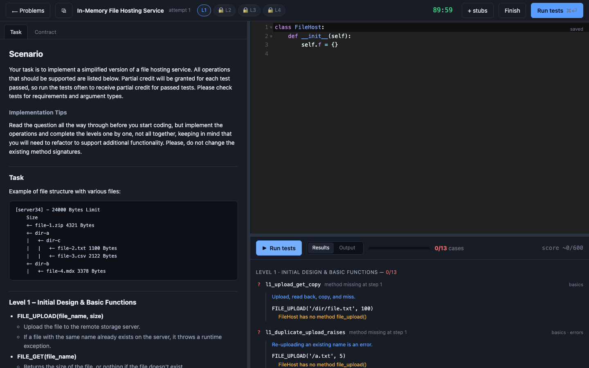
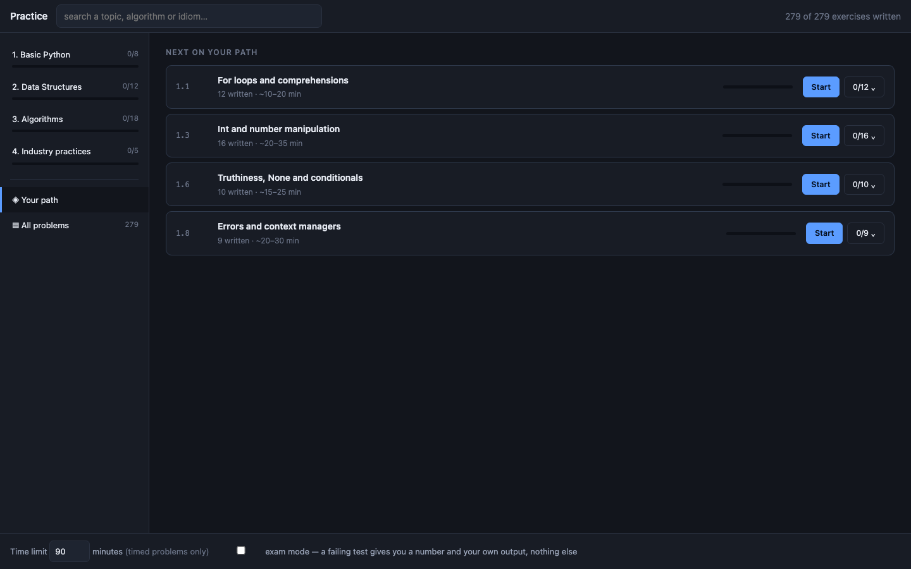
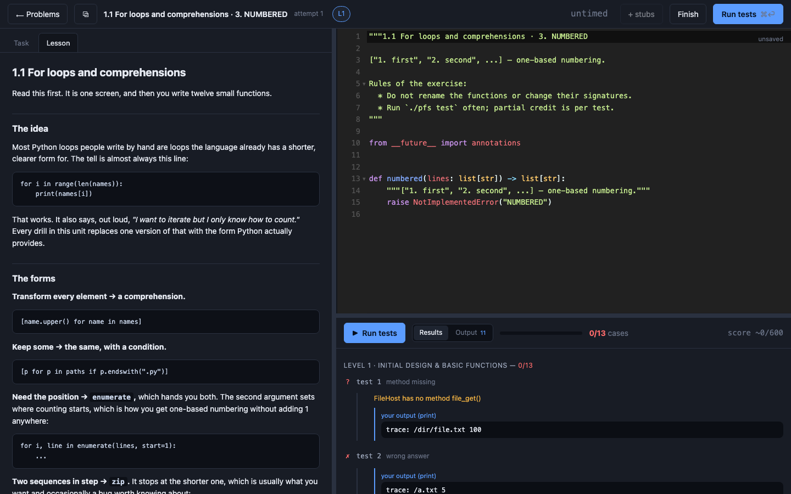
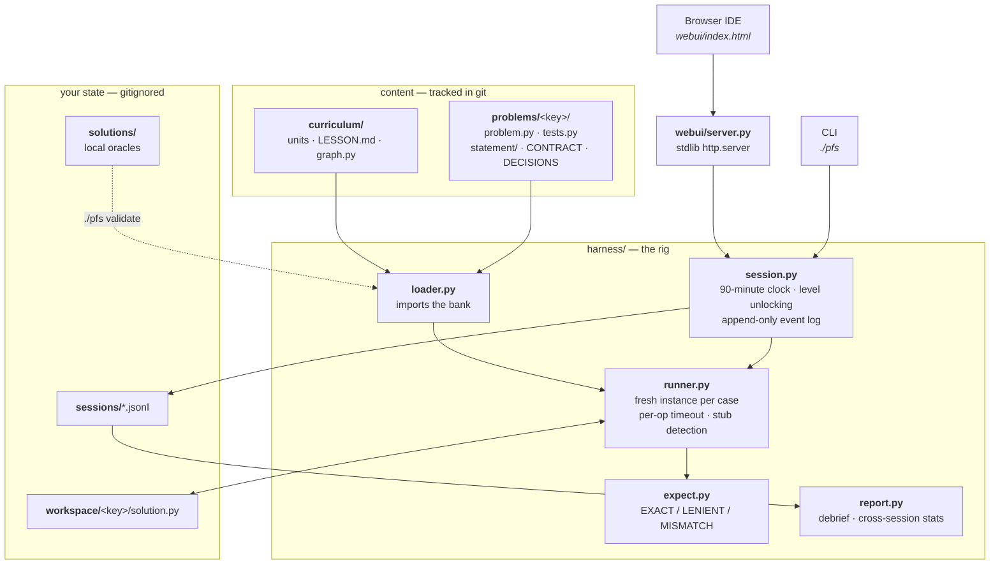
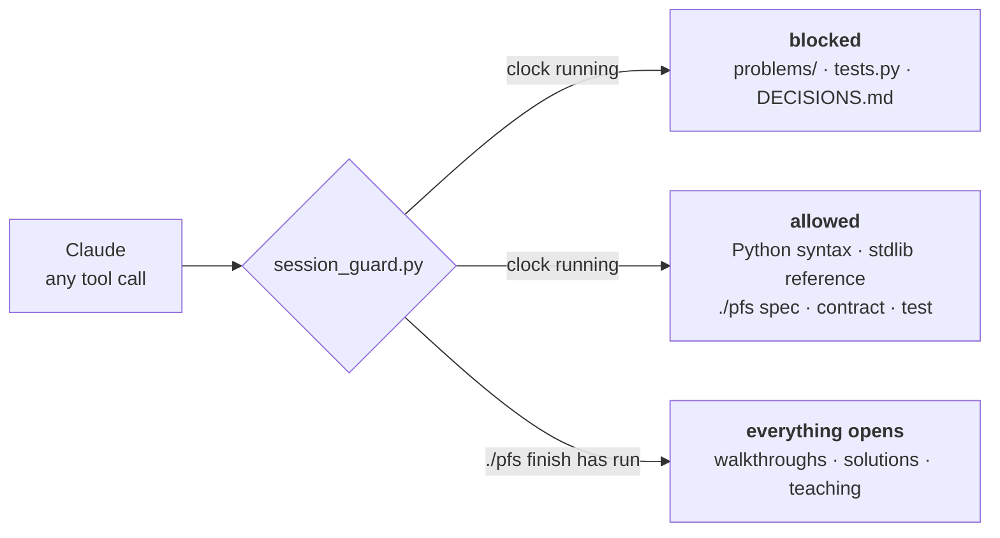
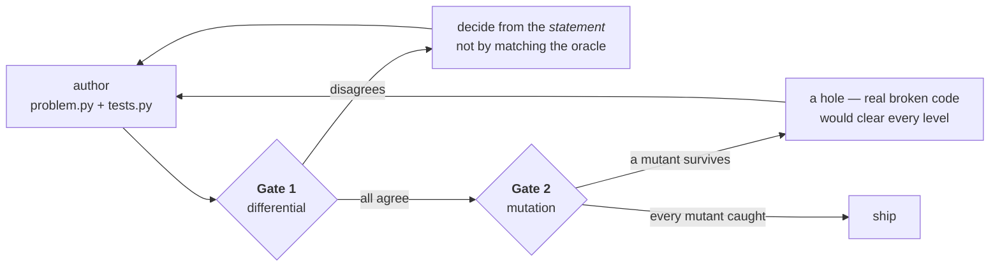

# Pyactice — a Python practice rig for the CodeSignal Industry Coding Framework

A timed, level-gated, self-checking practice environment for the 90-minute
CodeSignal assessment where one problem unfolds across four progressive levels —
and, around it, a 279-exercise curriculum that builds the Python you need to sit it.

Python 3.10+. **No dependencies** — the real assessment gives you the standard
library and nothing else, so neither does this.

## Start here

```bash
git clone <this repo> && cd Pyactice
./pfs ui
```

That opens a CodeSignal-style IDE in your browser at `http://127.0.0.1:8765`. Pick a
problem and the clock starts.




Everything you need is in that one window: the statement on the left, a real Python
editor with syntax highlighting in the middle, test results underneath. Levels unlock as
you clear them, the clock runs down, and your code autosaves.

**⌘↵ runs the tests.** Do it constantly — partial credit is per test.

When you clear a level, a prompt offers to paste the next level's method stubs into your
file. When you're done or out of time, hit **Finish** for the debrief, then **Read the
answer key** for every ambiguity and how it resolves.

No install, no dependencies — it's `http.server` and a vendored copy of CodeMirror.

<details>
<summary>Prefer the terminal? The same session works from the CLI.</summary>

```bash
./pfs start file_hosting   # starts the clock, writes workspace/file_hosting/solution.py
./pfs spec                 # the current level's statement
./pfs test                 # clearing every unlocked level unlocks the next
./pfs stubs --append       # add the newly unlocked level's stubs
./pfs finish               # debrief
./pfs decisions            # the answer key (refuses while the clock runs)
```

The browser IDE and the CLI share one session file and one workspace file, so you can
start in one and finish in the other.
</details>

### Retakes are unlimited

Start the same problem as many times as you like. Each attempt begins from clean stubs;
your previous code is moved into `workspace/<problem>/previous-attempts/`, never deleted.

```bash
./pfs start file_hosting            # attempt 2, fresh stubs
./pfs start file_hosting --resume   # or carry on with the code you already have
```

(The two-attempts-per-180-days rule in [docs/ASSESSMENT_BRIEF.md](docs/ASSESSMENT_BRIEF.md)
is CodeSignal's limit on the **real** test. It does not apply here.)

### If a test case looks wrong

Don't stop the clock to argue with it. Log it and keep moving:

```bash
./pfs dispute l3_zero_ttl_is_dead_on_arrival "a ttl of 0 should mean no expiry"
```

## Why not just do LeetCode

This format fails people for reasons LeetCode does not measure. There is no
algorithmic trick in it. What it measures is whether the state you designed in the
first ten minutes survives the requirements you have not read yet — and then whether
you can absorb an ambiguous spec change with 40 minutes on the clock without
breaking the levels you already passed.

So the rig simulates the parts that actually bite:

- **Levels are locked.** You cannot read level 3 while designing level 1, which is
  exactly the constraint that makes level 1 hard.
- **The clock runs.** 90 minutes, visible, and it does not pause.
- **Earlier levels keep being tested.** Every run re-runs every level at or below
  your current one, so a level-3 refactor that breaks level 1 shows up immediately —
  the most common real failure, and the one no static practice catches.
- **Most tests are hidden.** You see the case name and where it failed, not the
  answer. `--reveal` exists for after the session.
- **Exam mode strips even that.** `--blind` reduces a failure to an opaque test
  number, its outcome, and whatever your own code printed — which is all the real
  assessment gives you. The default feedback here (case names, tags, operation
  shapes) is a crutch worth practising without before it matters.
- **The statements are under-specified on purpose,** the way the real ones are.
  Every ambiguity has a documented resolution in the problem's `DECISIONS.md`, which
  the CLI refuses to show you while the clock is running.
- **It measures how you worked, not just what you scored** — time per level against
  budget, runs per level, and "stuck streaks" where several consecutive runs failed
  the same case, which is the signature of guessing.

## Commands

| | |
| --- | --- |
| `./pfs ui` | **the browser IDE — start here** (`--port`, `--no-open`) |
| `./pfs list` | the problem bank |
| `./pfs start <problem>` | begin a timed attempt (`--minutes`, `--level` to drill, `--force` to reset the file) |
| `./pfs start <problem> --blind` | exam mode: a failing test gives a number and your own output, nothing else |
| `./pfs spec` | current level's statement + auto-generated worked examples |
| `./pfs contract` | precise types and return shapes — **allowed during an attempt** |
| `./pfs test` | run every unlocked level; all green unlocks the next |
| `./pfs test --tag ttl --reveal` | drill one concept, with the operations shown |
| `./pfs status` | time left, current level, runs so far |
| `./pfs dispute <case> "..."` | log a case you think is wrong, without stopping to argue |
| `./pfs finish` | stop the clock and print the debrief |
| `./pfs decisions` | the answer key for every ambiguity (refuses while a session is live) |
| `./pfs answer <problem>` | a worked solution, `--level N` for levels 1..N only (refuses while live) |
| `./pfs stats` | cross-session trends and your weakest concepts |
| `./pfs validate` | self-check the problem bank |

## What is in the bank

279 exercises, 1827 test cases, in four kinds.



**Drills** (261, in 38 units) are the curriculum: one idiom, one function, no clock.
They sit in a graph of 43 subtopics across four categories — Basic Python, Data
Structures, Algorithms, Industry practices — each with a `LESSON.md` that teaches the
idea before you write anything. Most carry an AST constraint, so `FLIPPED` refuses to
let you call `reversed()` and you have to write the two-pointer swap. The constraint is
the exercise; without it you would reach for the library and learn nothing.



**Design problems** (12) are one class each, built from scratch — `LRU_CACHE`,
`MIN_STACK`, `TRIE`, `STREAMING_MEDIAN`. No levels and no clock, but a full sequence
of operations to satisfy.

**Progressive problems** (5) are the real thing: one class, four levels, 90 minutes.

| key | problem | level 1 |
| --- | --- | --- |
| `file_hosting` | In-memory file hosting service | upload, read and copy files |
| `cloud_storage` | Cloud storage | add, size and delete files |
| `in_memory_db` | In-memory key-value database | set, read and delete fields |
| `banking` | Banking system | accounts, deposits and transfers |
| `file_system` | Hierarchical file system | make directories, create, read and list |

Levels 2–4 are deliberately not listed. Knowing the *general* skeleton is fair prep and
[docs/ASSESSMENT_BRIEF.md](docs/ASSESSMENT_BRIEF.md) teaches it; knowing which specific
operations arrive at level 3 of *this* problem is the answer to the only question level 1
asks.

`file_hosting` reproduces CodeSignal's published sample
question verbatim; the rest are reconstructions of widely reported variants.
Provenance and confidence for each claim is in
[docs/ASSESSMENT_BRIEF.md](docs/ASSESSMENT_BRIEF.md).

They are deliberately not clones of each other. Two put the timestamp first and one
puts it last; two signal failure by raising and the rest by returning `None`; the
level-4 turn is a rollback, a re-anchored restore, a collision-aware restore, a
merge, and symbolic links. Rotating between them is what stops you memorising one
answer.

`file_system` is the odd one out and the hardest, on purpose. The other four store a
flat map of names, so there is no wrong design to make at level 1. This one is a real
tree: a flat `dict[path]` clears most of level 1 in five minutes and then costs you
level 3 (permissions keyed by path are orphaned by the first `MV`) and level 4 (links
have to be resolved mid-path by every operation you already wrote). That "your level-1
design decision comes due at level 3" pressure is the thing the real progressive format
is built to measure, and no other problem here exercises it.

## Architecture

One entry point (`./pfs`), one rig (`harness/`), and content that is data rather than
code paths. The browser IDE and the CLI are two front ends over the same session file,
which is why you can start an attempt in one and finish it in the other.



The three-document split per problem is the design decision everything else hangs off,
because it is what keeps an attempt honest:

| file | contains | readable during an attempt? |
| --- | --- | --- |
| `statement/levelN.md` | the question, terse and deliberately under-specified | yes |
| `CONTRACT.md` | types, return shapes, error convention | yes |
| `DECISIONS.md` | every ambiguity and its resolution — the answer key | **no** |

Content must not drift up that table. Making the statement clearer to be helpful
deletes the exact skill the assessment measures, which is committing to a defensible
reading under time pressure and adapting when a test disagrees.

## Are the tests right?

They are hand-authored, which means they are guesses until something executes them.
Each suite passes two gates before shipping:

- **Differential** — a throwaway reference implementation, written outside this repo
  and deleted afterwards, must agree with every single expected value.
- **Mutation** — the reference is then broken in each way real candidates break it
  (inclusive TTL boundary, missing tie-break, no top-N cap, single-snapshot rollback,
  a separate store after the level-3 refactor, …) and every mutant must be caught by
  at least one case. A mutant nobody catches is a hole: real broken code would clear
  all four levels and the practice would be lying to you.

| problem | cases | differential | mutants caught |
| --- | --- | --- | --- |
| `file_hosting` | 58 | all agree | 14/14 |
| `cloud_storage` | 46 | all agree | 19/19 |
| `in_memory_db` | 50 | all agree | 15/15 |
| `banking` | 41 | all agree | 23/23 |
| `file_system` | 60 | all agree | 27/27 |

The mutation gate earned its keep twice: it found a `cloud_storage` prefix rule and a
`banking` tie-break that no case actually tested — both would have let real broken code
clear all four levels.

No reference solutions ship with the repo — see [solutions/README.md](solutions/README.md)
for why, and for how to wire yours in after a walkthrough.

## Testing the rig

```bash
tests/run_all.sh
```

Three layers.

| layer | what it does |
| --- | --- |
| structural | the problem bank's own self-check (`./pfs validate`) — 279 problems |
| backend | 93 checks over every HTTP endpoint: payload shapes, the leak invariants, syntax errors, infinite loops, restart durability, path traversal |
| browser | 58 checks in real Chrome, asserting on **element geometry** as well as content, at three viewport sizes |

> **Do not run this during an attempt.** The suite needs a clean `sessions/` and
> `workspace/`, so it moves yours aside and restores them on exit. If it is killed
> partway, or the restore runs against an incomplete stash, your in-progress code and
> practice history are gone — there is no git history to recover them from, because both
> directories are deliberately gitignored. Finish first.

The browser layer uses `puppeteer-core` against the Chrome you already have — no
Chromium download. Screenshots land in `tests/shots/`.

Geometry assertions are the point. Every UI bug this rig has shipped was invisible to a
content-only test: a Run button pushed outside a narrow viewport, an editor collapsed to
zero height by a grid row that grew with its results, a dead backend that looked exactly
like a frozen page. So the tests measure boxes — is it in the DOM, is it non-zero, is it
*inside the viewport* — not just whether a selector matches.

## Docs

- [docs/ASSESSMENT_BRIEF.md](docs/ASSESSMENT_BRIEF.md) — what the assessment is, how
  it is scored and proctored, which problem families are real, with sources and
  confidence markers. Safe to read before your first attempt.
- [docs/PLAYBOOK.md](docs/PLAYBOOK.md) — how to attack the format. **Read it after
  your first cold attempt**, not before.

## Built with an AI coding agent

Almost all of this bank — 279 exercises, 1827 cases, 38 lesson files — was written by
Claude Code working against the rules in [CLAUDE.md](CLAUDE.md). That only works because
the repo is built to constrain the agent rather than trust it. Three mechanisms do the
work.

### 1. A hook that makes leaking impossible, not merely discouraged

The obvious failure mode of practising with an AI agent is that the agent has read the
answer key. Asking it nicely does not scale — a long session drifts, and "just tell me
what the failing case expects" is a very reasonable-sounding request.

So it is not a policy, it is a `PreToolUse` hook. `.claude/hooks/session_guard.py` sits
in front of every `Read`, `Edit`, `Write`, `Grep`, `Glob` and `Bash` call and refuses
anything that reaches into `problems/` while a clock is running:



The allowed list is deliberate: the real assessment lets you look up standard-library
documentation, so the practice environment does too. What it will not do is hand you an
algorithm, a data structure, or what a failing case expects. It fired on me repeatedly
while writing this README, which is the point.

### 2. Two gates, because hand-written expected values are guesses

Every case in the bank is a guess until something executes it. Nothing ships without
passing both:



Gate 1 is a throwaway reference implementation, written outside the repo. When it and a
case disagree, roughly a third of the time the *oracle* is wrong — and that argument is
exactly the ambiguity that belongs in `DECISIONS.md`.

Gate 2 breaks the reference the way real candidates break it and demands the suite
notice. Hand-written mutation catalogues do not scale to 261 one-function drills, so
[tools/drill_mutation.py](tools/drill_mutation.py) generates mutants mechanically —
flipped comparisons, off-by-one integers, inverted guards, dropped negations — then
fuzzes each survivor against the oracle to produce a counterexample.

The single most valuable lesson from building this: **a verification tool that reports
success while testing nothing is worse than no tool.** The drill fuzzer twice reported
"0 counterexamples" on units it had never meaningfully exercised — it was generating
`None` for every argument and testing only the empty case. Both times, fixing it to
report **UNJUDGED** instead of "clean" immediately exposed real gaps.

### 3. A loop, not a chat

- [.claude/skills/harness-engineering/](.claude/skills/harness-engineering/) — adding
  problems, authoring cases, the two gates, runner internals. Read before touching
  `harness/` or `problems/`.
- [.claude/skills/loop-engineering/](.claude/skills/loop-engineering/) — the practice
  loop itself: cold attempt → debrief → targeted drill → rotate, and how to read
  `./pfs stats`.
- [.claude/agents/icf-coach.md](.claude/agents/icf-coach.md) — proctors a live attempt
  without leaking, then debriefs properly once `./pfs finish` has run.
- [.claude/agents/oracle-verifier.md](.claude/agents/oracle-verifier.md) — runs both
  gates in a subagent, keeping the oracle out of the main session's context.
- [.claude/agents/disclosure-auditor.md](.claude/agents/disclosure-auditor.md) — checks
  that every documented tie-break is demonstrated by a visible case, and that no
  statement has drifted upward.

### Should you commit `.claude/`?

Yes — and this repo does. The hooks are a *correctness* mechanism, not a personal
preference: without `session_guard.py`, a collaborator's agent would cheerfully leak
the answer key. The skills encode rules that are otherwise only in one person's head.
What stays out is `.claude/settings.local.json`, which holds machine-local permission
grants with absolute paths.


## Suggested first session

```bash
./pfs list
./pfs start file_hosting        # then do not read anything else for 90 minutes
./pfs finish
./pfs decisions
```

Then read the playbook, and take a different problem two days later.
